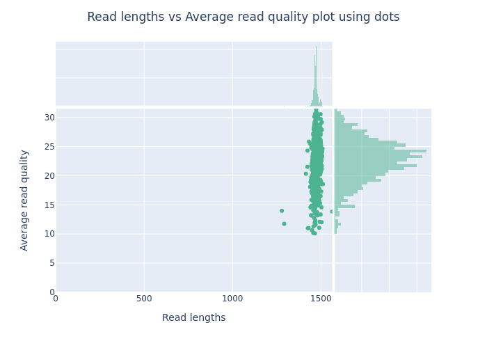

# Snakemake workflow: `ONT-AmpSeq`

[](https://snakemake.github.io)
[](https://github.com/MathiasEskildsen/ONT-AmpSeq/actions?query=branch%3Amain+workflow%3ATests)

## Description
ONT-AmpSeq is a complete Snakemake workflow, designed to generate OTU-tables from demultiplexed amplicon data. The pipeline was developed using the following [snakemake template](https://github.com/cmc-aau/snakemake_project_template). The final product of the pipeline is OTU tables formatted to be directly compatiable with the R-packages [ampvis2](https://kasperskytte.github.io/ampvis2/index.html) and [phyloSeq](https://github.com/joey711/phyloseq), enabling further analysis and visualisation of the microbial composition of the processed samples. ONT-AmpSeq expects the input files to be demultiplexed and basecalled prior to running the workflow, using programs such as [dorado](https://github.com/nanoporetech/dorado). The workflow filters data based on user-defined thresholds, which are set in the configuration file `config/config.yaml`. This allows for changes to filter thresholds related to amplicon length and quality, using [chopper](https://github.com/wdecoster/chopper). The amplicon thresholds for each dataset can be assessed using the bash [statistics script](#stats-script-nanoplotsh) located at `~/ONT-AmpSeq/workflow/scripts/nanoplot.sh`. An user guide for preliminary visualisation and analysis to estimate the user-defined thresholds can be found [here](#stats-script-nanoplotsh).
Then ONT-AmpSeq pipeline generates biologically meaningful consensus OTU's from each sample by initially clustering the reads into OTU's using [Vsearch](https://github.com/torognes/vsearch) and denoising them using the [UNOISE3](https://doi.org/10.1093/bioinformatics/btv401) algorithm. OTU's from all samples are then merged and polished using [Racon](https://github.com/isovic/racon) to minimise sequence errors. Taxonomy is assigned to the OTU's using either the [SINTAX](https://drive5.com/usearch/manual/sintax_algo.html) algorithm or the [BLAST](https://blast.ncbi.nlm.nih.gov/Blast.cgi) algorithm (more information on taxonomy and databases can be found [here](#databases)).
NOTE:
This workflow is actively maintained and supported, with new features continuously being implemented.

## Table of Contents
- [Requirements](#requirements)
- [Usage of Workflow with Snakedeploy](#usage-of-workflow-snakedeploy)
- [Uage of Workflow AAU Biocloud Users](#usage-of-workflow-aau-biocloud-hpc-users)
- [Outputs](#outputs)
- [Stats script](#stats-script-nanoplotsh)
- [Database Choice](#databases)

## Requirements
### Hardware requirements
As a general recommendation for running ONT-AmpSeq whilst producing every possible output, at least 32 threads and 40 GB of memory are advised. THese high requirements stem from the multithreading capabilities of the various software and tools used in the pipeline, as well as the need/possibility to handle very large datasets and databases. While the pipeline has been successfully run with 1 thread and as little as 4 GB of memory using smaller datasets `~/ONT-AmpSeq/.test/test_data` and the MiDAS v5.3 [SINTAX database](https://www.midasfieldguide.org/guide/downloads), using large datasets may cause minimap2 to run out of memory. Additionally, loading the general BLAST-formatted [GenBank database](https://www.ncbi.nlm.nih.gov/genbank/) requires ~40 GB of memory. For more details, see [BLAST database formatting](#databases).

### Software requirements
To run ONT-AmpSeq, Linux OS or Windows Subsystem for Linux (WSL) is required. Installation of software/tools utilized in the workflow is based on, and requires, conda. Using Snakemake, the correct versions of the tools will automatically be installed to ensure version compatibility. However, prior to installing ONT-AmpSeq, conda and the appropriate conda environment are required to facilitate the installation of the various utilised tools for both the Snakemake and SnakeDeploy installations. For more details, see [SnakeDeploy installation](#usage-of-workflow-snakedeploy).

Conda can be installed by following this [guide](https://conda.io/projects/conda/en/latest/user-guide/install/index.html) or Mamba can be installed by following this [guide](https://mamba.readthedocs.io/en/latest/installation/mamba-installation.html).
It is recommended to follow the original documentation. However, below are the commands used to freshly install the software on a Linux machine as per their documentation (14-05-2024).
Latest version of Miniconda:
```
mkdir -p ~/miniconda3
wget https://repo.anaconda.com/miniconda/Miniconda3-latest-Linux-x86_64.sh -O ~/miniconda3/miniconda.sh
bash ~/miniconda3/miniconda.sh -b -u -p ~/miniconda3
rm -rf ~/miniconda3/miniconda.sh
```  
Initialize Miniconda:
```
~/miniconda3/bin/conda init bash
~/miniconda3/bin/conda init zsh
```
Add channels (for fresh install):
```
conda config --add channels conda-forge
conda config --add channels bioconda
```

Now your conda install is correctly configured and you're ready to create your conda environment for Snakemake.

## Usage of ONT-AmpSeq using SnakeDeploy
### Step 1: Install Snakemake and SnakeDeploy
Compatible versions of Snakemake and SnakeDeploy for this guide are installed via the [Mamba package manager](https://github.com/mamba-org/mamba) (a package manager alternative for conda). If you have neither Conda nor Mamba, it can be installed via [Mambaforge](https://github.com/conda-forge/miniforge#mambaforge) or refer to the Miniconda installation and setup in [Requirements](#software-requirements).
Given that Mamba (If Miniconda is installed, then mamba can be changed for conda) is installed, a compatible conda environment for Snakemake and SnakeDeploy can be created by running:
```
mamba create -c conda-forge -c bioconda --name snakemake snakemake=7.18.2 snakedeploy
```
This command installs both Snakemake and SnakeDeploy in the same environment called `snakemake`. To run ONT-AmpSeq using the SnakeDeploy method, activate this environment with `mamba activate snakemake`, prior to executing any of the following commands.
### Step 2: Deploy workflow
Given that Snakemake and Snakedeploy are installed and activated in [step 1](#step-1-install-snakemake-and-snakedeploy), the workflow can now be deployed through the following steps.
First, create an appropriate project working directory on your system and change your location to said directory:
```
mkdir -p path/to/ONT-AmpSeq
cd path/to/ONT-AmpSeq
```
In the following steps, it is assumed that you are located in your working directory `path/to/ONT-AmpSeq`.
Second, run the SnakeDeploy command for ONT-AmpSeq:
```
snakedeploy deploy-workflow https://github.com/MathiasEskildsen/ONT-AmpSeq . --branch main
```

SnakeDeploy will then create two directories: `workflow` and `config`. The `workflow` directory contains the deployment of the chosen workflow (ONT-AmpSeq) as a [Snakemake module](https://snakemake.readthedocs.io/en/stable/snakefiles/deployment.html#using-and-combining-pre-exising-workflows). The `config` directory contains configuration files, that can be modified to suit user-defined criteria and individual datasets. When executing the workflow, Snakemake will automatically find the main `Snakefile` in the `workflow` subdirectory. 

It is recommended to put this directory under version control, for example by managing it [via a (private) Github repository](https://docs.github.com/en/migrations/importing-source-code/using-the-command-line-to-import-source-code/adding-locally-hosted-code-to-github).

### Step 3: Configure the workflow
The workflow needs to be configured according to the individual dataset content and requirements. Below is a thorough explaination of the settings that can be configured. These can either be changed directly in the config file located at `path/to/ONT-AmpSeq/config/config.yaml` or changed by command line arguments:
* `input_dir`: Path to the input directory, containing fastq files in compressed `file.fastq.gz` or decompressed `file.fastq` format. The pipeline expects the input files to conform to one of two directory structures. See [here](#stats-script-nanoplotsh) for more information on directory structures.
* `output_dir`: Name and path to the output directory with the final OTU tables created by ONT-AmpSeq and a few important intermediary files, which may prove useful for other purposes.
* `tmp_dir`: Directory for temporary files. Temporary files will be removed after a succesful run.
* `log_dir`: Directory for log files for all invoked rules, which may be useful for debugging.
* `db_path_sintax`: Path to a [SINTAX formatted database](https://drive5.com/usearch/manual/sintax_algo.html), used to annotate consensus OTU's. For more information regarding SINTAX formatted databases, algorithm and how to find/create then, see [databases](#sintax-database).
* `db_path_blast`: Path to a nucleotide formatted [BLAST database](https://blast.ncbi.nlm.nih.gov/Blast.cgi). For more information regarding BLAST formatted databases, algorithms, and how to find or create them, see [databases](#blast-database).
* `evalue`: E-value cutoff for BLAST. Defaultvalue = 1e-10. See [databases](#blast-database).
* `length_lower_limit`: Lower threshold length for filtering of amplicons. Default = 1200 bp. The amplicon filtering length should be adjusted, depending on the individual amplicon length for the given dataset. See [stats script](#stats-script-nanoplotsh) for a guide to setting an appropriate length treshold using the script `ONT-AmpSeq/workflow/scripts/nanoplot.sh`.
* `length_upper_limit`: Upper threshold length for filtering of amplicons. Default = 1600 bp. The amplicon filtering length should be changed, depending on the individual amplicon length for the given dataset. See [stats script](#stats-script-nanoplotsh) for a guide to setting an appropriate length treshold using the script `ONT-AmpSeq/workflow/scripts/nanoplot.sh`.
* `quality_cut_off`: Phred-quality score threshold (Q-score). Default = 23. To select an appropriate Q-score for a dataset, see [stats script](#stats-script-nanoplotsh) for a detailed guide for choosing appropriate Q-score and its effects.
* `max_threads`: Maximum number of threads that can be used for any given rule.
* `include_blast_output`: Default = true. If true, ONT-AmpSeq will annotate the final OTU-table using the [BLAST](https://blast.ncbi.nlm.nih.gov/Blast.cgi) algorithm and a BlASTn formatted database.
* `include_sintax_output`: Default = true. If true, ONT-AmpSeq will annotate the final OTU-table using the SINTAX algorithm and a [SINTAX formatted database](https://drive5.com/usearch/manual/sintax_algo.html).

The workflow configurations can also be changed directly via the command line. When specifying the configuration parameters through the command line, default values will be used unless otherwise specified. To specify changed values for the configuration through the command line, use the following structure:
```
cd path/to/ONT-AmpSeq
mamba activate snakemake
snakemake --cores all --use-conda --config include_blast_output=false db_path_sintax=/path/to/SINTAX_DATABASE.fa length_lower_limit=400 length_upper_limit=800 quality_cut_off=20
```

The code snippet above will:
1. Change your working directory
2. Activate your conda environment containing Snakemake, as described in [step 1](#step-1-install-snakemake-and-snakedeploy).
3. Run the ONT-AmpSeq pipeline using the specified configuration values. Disable the use of the BLAST algorithm, annotate the OTU’s using the SINTAX algorithm via the specified database path, , and filter the amplicon data to only include reads between 400 – 800bp with a Q-score <20.

NOTE: `--cores all` instructs Snakemake to use all available threads available on your machine, this can be changed according to your requirements. `--use-conda` enables Snakemake to run jobs in a conda environment, necesarry for certain rules.
### Step 4: Run the workflow
Now that the workflow has been properly deployed and configured, it can be executed using the conda environment named `snakemake`. Using the following command:
```
cd path/to/ONT-AmpSeq
mamba activate snakemake
snakemake --cores all --use-conda
```
Given that you have chosen your project working-directory as previously stated. Snakemake will automatically detect the main `Snakefile` in the `workflow` subfolder, which it will use to execute the workflow module from [step 2](#step-2-deploy-workflow).

For further options, such as cluster and cloud execution, refer to [the documentation](https://snakemake.readthedocs.io/en/stable/). If you are an AAU BioCloud HPC user, see [this](#usage-of-workflow-through-slurm-aau-biocloud-users) section.
### Step 5: Generate report
After analysing the specified data, a report of the Snakemake run can automatically be generated in an interactive visual HTML format to inspect the run-time of individual rules and code of each rule, inside the browser using:
```
snakemake --report report.html
```
The resulting `report.html` file can be shared with collaborators, provided as a supplementary file in publications, or uploaded to a service like [Zenodo](https://zenodo.org/) in a citable [DOI](https://en.wikipedia.org/wiki/Digital_object_identifier).

The usage of this workflow is also described in the [Snakemake Workflow Catalog](https://snakemake.github.io/snakemake-workflow-catalog?usage=MathiasEskildsen/ONT-AmpSeq).

## Usage of workflow (AAU BioCloud HPC users)
AAU BioCloud HPC users can also use the snakedeploy [step-by-step](#usage-with-snakedeploy). However, it is recommended to follow the guide below as it will install and unpack the pipeline for the individual user and also include scripts to assist in submitting jhobs via [SLURM](https://slurm.schedmd.com/documentation.html). For further guidance on Snakemake and BioCloud HPC usage, refer to the [BioCloud HPC user guide](https://cmc-aau.github.io/biocloud-docs/guides/snakemake/intro/).

```
cd /path/to/home-dir
wget -qO- https://github.com/MathiasEskildsen/ONT-AmpSeq/archive/refs/heads/main.tar.gz | tar -xzf -
```
Install dependencies (BioCloud users already have mamba installed natively)
```
cd /path/to/home-dir/ONT-AmpSeq-main
mamba env create -f environment.yml
```
Configure the `config/config.yaml` as described [previously](#step-3-configure-the-workflow). Then simply run `snakemake --profile profiles/biocloud` or submit a SLURM job using the `slurm_submit.sbatch` example script. If running the pipeline through `slurm_submit.sbatch`, remember to change the `#SBATCH` arguments at the top of the script, to fit your run (--job-name, --mail and --time). Snakemake will automatically queue jobs with the necesarry ressources, so you do not need to change ressources (--mem and --cpus-per-task) specified in `slurm_submit.sbatch`.

## Outputs
NOTE: `{id}` refers to the percentage identity which reads should be similar in order to be clustered into an OTU. Defaults = [97%, 99%]. `{tax}` refers to the annotation method for the final output. The values are either BLAST or SINTAX.
* `ONT-AmpSeq-main/results/final/{id}/OTUtable_tax_{id}_{tax}.tsv`: This matrix contains the number of reads per sample per OTU. The taxonomy of each OTU is annotated by using either the [SINTAX](#sintax-database) or [BLAST](#blast-database) algorithm. The OTU tables are formatted to be ready for data analysis using [Ampvis2](https://kasperskytte.github.io/ampvis2/index.html).
NOTE: BLAST results in a high degree of “edge-cases” due to the formatting of output taxonomy. Which has no restrictions on the database header format. Be sure to manually inspect and double-check the annotated taxonomy when using this approach, as it can result in problems with the [Ampvis2](https://kasperskytte.github.io/ampvis2/index.html) R-package. See [BLAST] (#databases) for more information regarding the BLASTn formatted database.
* `ONT-AmpSeq-main/results/final/{id}/phyloseq_tax_{id}_{tax}.tsv`: This matrix contains taxonomy for each OTU annotated by using either the [SINTAX algorithm](#sintax-database) or [BLAST algorithm](#blast-database). This taxonomy table is preformatted to be directly compatible with the `tax_table` variable for creating and analysing a [phyloseq object]( https://joey711.github.io/phyloseq/).
* `ONT-AmpSeq-main/results/final/{id}/phyloseq_abundance_{id}_{tax}.tsv`: This matrix contains number of reads per sample per OTU. This OTU table is preformatted to be directly compatible with the otu_table for creating and analysing a [phyloseq object]( https://joey711.github.io/phyloseq/).
* `ONT-AmpSeq-main/results/final/report/total_reads.tsv`: This file provides an overview of the number of reads in each sample pre- and post-filtering.
## Stats script (nanoplot.sh)
The stats script, `nanoplot.sh`, is a bash-script used to visualise read characteristics of the amplicon-sequencing data produced by ONT. The script works on both compressed and decompressed `*.fastq` files. The files can be located in the same directory or individual sub-directores. However, if the files are located in the same directory, files originating from the same barcode must be merged prior to executing the script. 
Examples of accepted input directory structures for the script and the `ONT-AmpSeq` workflow:
```
path/to/home-dir/ONT-AmpSeq-main/data
└── samples
    ├── barcode01
    │   ├── PAQ88430_pass_barcode01_807aee6b_5f7fc5bf_0.fastq
    │   ├── PAQ88430_pass_barcode01_807aee6b_5f7fc5bf_1.fastq
    │   └── PAQ88430_pass_barcode01_807aee6b_5f7fc5bf_2.fastq
    ├── barcode02
    │   ├── PAQ88430_pass_barcode02_807aee6b_5f7fc5bf_0.fastq
    │   ├── PAQ88430_pass_barcode02_807aee6b_5f7fc5bf_1.fastq
    │   └── PAQ88430_pass_barcode02_807aee6b_5f7fc5bf_2.fastq
    └── barcode03
        ├── PAQ88430_pass_barcode03_807aee6b_5f7fc5bf_0.fastq
        ├── PAQ88430_pass_barcode03_807aee6b_5f7fc5bf_1.fastq
        └── PAQ88430_pass_barcode03_807aee6b_5f7fc5bf_2.fastq
```
```
path/to/home-dir/ONT-AmpSeq-main/data
└── samples
    ├── PAQ88430_pass_barcode01_807aee6b.fastq
    ├── PAQ88430_pass_barcode02_807aee6b.fastq
    └── PAQ88430_pass_barcode03_807aee6b.fastq
```
To create a conda environment for the stats script, containing [NanoPlot](https://github.com/wdecoster/NanoPlot) version 1.42.0, you can use the following command:

```
cd path/to/home-dir/ONT-AmpSeq-main
mamba env create -f stats.yml
```
The bash-script `nanoplot.sh`, found in `path/to/home-dir/ONT-AmpSeq-main/workflow/scripts/nanoplot.sh`, has the following parameters:
```
-- insert full pipeline name: Nanopore Statistics with NanoPlot
usage: nanoplot [-h] [-o path] [-i path] [-t value] [-j value]

where:
    -h Show this help message.
    -o Output directory path for the processed files. The script automatically creates a directory based on the specified user-defined output name.
    -i Full path to the input files. If using the default fastq folders created by MinKNOW, a example path could be: /Full/Path/to/nanopore_data/ONT_RUN_ID/fastq_pass.  
    -j Number of parallel jobs [default = 1]
    -t Number of threads [default = 1]
    Important note:
    Remember to activate your conda environment, containing nanoplot version 1.42.0, before running the script.
    If installed through stats.yml, activate the environment with mamba activate stats.
    The total number of threads used by the script is number of parallel jobs multiplied by the number of threads. For example -j 2 -t 10 equals 20 threads in total.
```
Example command:

```
mamba activate stats
cd path/to/home-dir/ONT-AmpSeq-main
bash workflow/scripts/nanoplot.sh -o path/to/out_dir -i path/to/data/samples -t 1 -j 1 
```
The `nanoplot.sh` script will then create a directory based on the specified output variable containing three sub-directories: `stats`, `fastqs` and `joblog`. The `stats` sub-directory contains plots for each respective sample, located in individual sub-directories named after their respective fastq file. Within these sub-directories the `LengthVsQualityScatterPlot_dot.png` provides a great overview of the read characteristics for each sample. `fastqs` contains unzipped merged fastq files, which can be used in the main snakemake workflow or be removed. The last directory `joablog`, contains a text file with the command-line output. This can be useful for debugging.
### Analysis of stats results
This section will describe how to determine tresholds for the ONT-AmpSeq configuration, using the stats-script located at `path/to/home-dir/ONT-AmpSeq-main/workflow/scripts/nanoplot.sh` and a tiny dataset located at `path/to/home-dir/ONT-AmpSeq-main/.test/test_data` containing 16S rRNA V1-8 amplicons.
```
cd path/to/home-dir/ONT-AmpSeq-main
mamba activate stats
bash workflow/scripts/nanoplot.sh -t 1 -j 1 -o .test/stats_out -i .test/test_data
```
This will generate statistics for each sample, enabling ONT-AmpSeq configuration. An easy way to asses the amplicon length and quality is through the plot `LengthvsQualityScatterPlot_dot.png`
<figure id="figref-nanoplot">
  
  <figcaption>
  <strong>Figure 1:</strong> Example plot of read length vs average quality generated by Nanoplot. This example shows one distinct amplicon for the 16S rRNA V1-8. 
  </figcaption>
</figure>

The generated figure clearly shows reads with the length of ~1500 bp and most of the reads with a Q-score >20. This information can be used to configure the ONT-AmpSeq pipeline.

## Databases
Before running the pipeline, it is important to determine the type of database that is most relevant for the individual dataset and application. Ideally, a manually curated environmentally specific database should be used, as it would yield the best results and require the least amount of processing power. It is always recommend to use a [SINTAX database](https://drive5.com/usearch/manual/sintax_algo.html) over a [BLAST database](https://blast.ncbi.nlm.nih.gov/Blast.cgi) when possible, due to the significantly lower processing time, requirements, more accurate bootstrap-supported taxonomy, and optimised formatting for post-processing via the [Ampvis2](https://kasperskytte.github.io/ampvis2/index.html) or [phyloseq]( https://joey711.github.io/phyloseq/) R-packages.
### SINTAX database
A [SINTAX database](https://drive5.com/usearch/manual/sintax_algo.html) essentially consists of a fasta file, where each sequence header includes the complete taxonomy, formatted with the specific delimiters and syntax. This format enables the use of bootstrap supported confidence values for taxonomic annotation, thereby only allowing the supported taxonomic level to be assigned, unlike the [BLAST](https://blast.ncbi.nlm.nih.gov/Blast.cgi algorithm. 
The [SINTAX database](https://drive5.com/usearch/manual/sintax_algo.html) file must be formatted as follows to ensure accurate taxonomy assignment. It is essential to have the `;tax=` following header name and the respective `x: ` before taxonomic annotation of each given rank separated by a comma `,`. If this exact setup is not followed, the final annotation of the OTU tables will not be able to be analysed correctly using the [Ampvis2](https://kasperskytte.github.io/ampvis2/index.html) or [phyloseq]( https://joey711.github.io/phyloseq/) R-packages. An example of the general structure is as follows:
```
>unique_name1;tax=d:Kingdom,p:Phylum,c:Class,o:Order,f:Family,g:Genus,s:Species
Sequence
>unique_name2;tax=d:Kingdom,p:Phylum,c:Class,o:Order,f:Family,g:Genus,s:Species_strain
Sequence
```
An example of this structure is the [gnomAD database](https://gnomad.broadinstitute.org/), which is an environmentally specific manually-curated database for the human gut. This database has been adapted and reformatted as a full-length 16S rRNA SINTAX database located in `.test/databases/human_gut_rRNA_SSU_FL_sintax.fasta`, which looks like:
```
>MGYG000003569;tax=d:Bacteria,p:Spirochaetota,c:Spirochaetia,o:Treponematales,f:Treponemataceae,g:Treponema_D,s:sp900769975;
ATGAAGAGTTTGATCCTGGCTCAGGATGAACGCTAGCGGCAGGCTTAACACATGCAAGTCGAGGGGTAACAGGTTAGTAGCAATACTGATGCTGACGACCGGCGCACGGGTGCGTAACGCGTATGCAACCTACCTTATACAGGGGGATAACCTTTCGAAAGGGAGA...
>MGYG000003543;tax=d:Bacteria,p:Bacteroidota,c:Bacteroidia,o:Bacteroidales,f:Bacteroidaceae,g:HGM04593,s:sp900769465;
AAGGAGGTGTTCCAGCCGCACCTTCCGGTACGGCTACCTTGTTACGACTTAGCCCCAATCACCAGTTTCACCCTAGGCCGATCCTCGCGGTTACGGACTTCAGGTGCCCCCGGCTTTCATGGCTTGACGGGCGGTGTGTACAAGGCCCGGGAACGTATTCACCGCG...
```
If a specialised database for a given environment or dataset is available, it is highly recommended to reformat the specified fasta sequences to this SINTAX format and use it as a reference database. The SINTAX database is therefore only limited by the quality of the references and whether a given study has been conducted for the desired environment.
Other examples of environmentally specific databases could be the 16S rRNA database for wastewater, [MiDAS](https://www.midasfieldguide.org/guide/downloads), which already contains a SINTAX-formatted database for this environment. 
### BLAST database
The other option for `ONT-AmpSeq` is taxonomic annotation using [BLAST](https://blast.ncbi.nlm.nih.gov/Blast.cgi) formatted BLASTn database. This option requires significantly longer processing time and contains significant limitations regarding taxonomic annotation, compared to SITNAX. A blast hit is accepted if it is above the given [e-value](#step-3-configure-the-workflow) threshold (default: 1e-10). If the match between query and refrence is above this threshold, the full annotation from the given database is added to the OTU. This does not account for whether the annotation is correct or to what degree it is accurate. Simply, if the match is above the given e-value, the full annotation is given. A BLAST-formatted database can be created from any fasta file using the [makeblastdb](https://www.ncbi.nlm.nih.gov/books/NBK569841/) command. The structure of said fasta file, used for a database, is much less restricted regarding sequence header name and could be one of these examples, among others:
```
>unique_name1 Genus Species gene name
Sequences
> unique_name2 Escherichia Coli 16S rRNA
Sequence
```

Another example is the [GenBank database](https://www.ncbi.nlm.nih.gov/genbank/) fasta format, which is a bit more consistently formatted with this general structure:
```
> gi|gi_number|gb|accession_number| description of sequence
Sequence
```
Specific example:
```
>gi|63148399|gb|AY851612.1| Homo sapiens miRNA hsa-mir-499
AGTGAATCCAGGATGGTTGTGTTTGGTTTGTGTTTGGAGGGTCTGGGTCTTGTGA
```
If a desired fasta file could be used as a reference database, yet for some reason not possible to be reformatted into a [SINTAX database](#sintax-database), either due to lacking taxonomy or a requirement of gene information. Any fasta file, containing unique headers and nucleotide sequences, could be reformatted into a [BLASTn database](https://www.ncbi.nlm.nih.gov/books/NBK569841/), using the following command:
```
makeblastdb -in /path/to/data.fa -dbtype nucl -out /path/to/name
```
NOTE: To use this command a conda environment containing [BLAST](https://bioconda.github.io/recipes/blast/README.html) is required. If the pipeline has been installed through [AAU installation guide](#usage-of-workflow-aau-biocloud-hpc-users). A conda environment containing [BLAST](https://bioconda.github.io/recipes/blast/README.html) is available through the `stats.yml` environment and if installed can be activated through `mamba activate stats`.
NOTE: When using a [BLAST database](https://blast.ncbi.nlm.nih.gov/Blast.cgi), the name of the database must be specified. For example, the [GenBank database](https://www.ncbi.nlm.nih.gov/genbank/) is created from a file "nt". Therefore, to specify the path to the database, `path/to/blast_database/nt` is required, as [BLAST](https://blast.ncbi.nlm.nih.gov/Blast.cgi) will not start if given the directory only `path/to/blast_database/`, despite it being correctly formatted and containing the correctly named database.
If a dataset lacks specific databases for the given environment or amplicon, large preformatted [BLAST databases]( https://www.ncbi.nlm.nih.gov/genbank/) containing nearly every known gene, such as the [NCBI GenBank database](https://www.ncbi.nlm.nih.gov/genbank/), can be downloaded from [here]( https://www.ncbi.nlm.nih.gov/genbank/release/). However, these databases are enormous, containing vast amounts of data. For reference, [NCBI GenBank version 259](https://www.ncbi.nlm.nih.gov/genbank/release/259/) contains 249,060,436 sequences or 2,570,711,588,044 bases and requires 367 GB of disk space to download. Another significant limitation of such vast databases is the high degree of false positives in hits, potentially identifying uncultured bacteria without taxonomy or not necessarily providing the correct hit, but rather the one within the database that yields the lowest e-value.

# ONT-AmpSeq in bash-script format
ONT-AmpSeq was originally made as a simple bash-script. This can be downloaded from a deprecated reposiory [here](https://github.com/MathiasEskildsen/ONT_OTU_Table). This can be used following the guidelines.

# TODO
* Add release version
* Add split_taxonomy.py script to better handle edge case annotation from blast
* Add .test to pass linting test